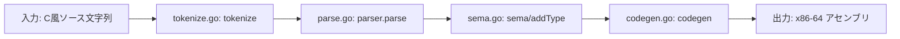
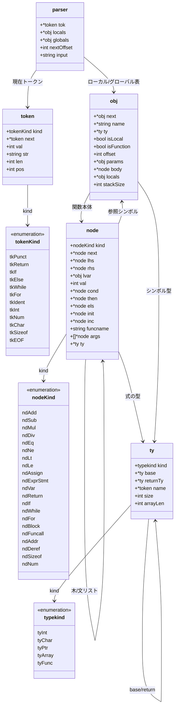

# g9cc アーキテクチャ

このドキュメントは、現在の `g9cc` 実装がどのような構造で動いているかをまとめたものです。

## 1. 全体フロー



### 各段階の役割

- `tokenize`
  - 入力文字列を `token` の連結リストに変換する
  - 予約語（`return if else while for int char sizeof`）を分類する
- `parse`
  - 再帰下降パーサで AST（`node`）を構築する
  - 変数・関数シンボル（`obj`）を構築する
  - 宣言型（`obj.ty`）とローカル変数のオフセットを確定する
- `sema(addType)`
  - 式ノードに型（`node.ty`）を付与する
  - 配列の decay、ポインタ演算のスケーリング、`sizeof` の定数化を行う
- `codegen`
  - 型付き AST とシンボル情報から `.data/.text` を出力する

## 2. データ構造



## 3. 構文（現在実装）

```text
program      = (funcdef | global-variable)*

funcdef      = declspec ident "(" (declspec ident ("," declspec ident)*)? ")" stmt
global-var   = declspec declarator ("," declarator)* ";"

stmt         = exprStmt
             | "if" "(" expr ")" stmt ("else" stmt)?
             | "return" expr ";"
             | "while" "(" expr ")" stmt
             | "for" "(" expr? ";" expr? ";" expr? ")" stmt
             | "{" stmt* "}"
             | declaration

declaration  = declspec (declarator ("=" expr)? ("," declarator ("=" expr)?)*)? ";"

declspec     = "int" | "char"
declarator   = "*"* ident type-suffix
type-suffix  = "(" (declspec ident ("," declspec ident)*)? ")"
             | "[" num "]" type-suffix
             | ε

exprStmt     = expr? ";"
expr         = assign
assign       = equality ("=" assign)?
equality     = relational (("==" | "!=") relational)*
relational   = add (("<" | "<=" | ">" | ">=") add)*
add          = mul (("+" | "-") mul)*
mul          = unary (("*" | "/") unary)*
unary        = ("+" | "-") unary
             | "*" unary
             | "&" unary
             | "sizeof" unary
             | postfix
postfix      = primary ("[" expr "]")*
primary      = "(" expr ")"
             | ident ("(" (assign ("," assign)*)? ")")?
             | num
```

## 4. 型とサイズ

- `int`: `size=4`
- `char`: `size=1`
- `ptr`: `size=8`
- `array`: `size = base.size * 要素数`
- `func`: 関数型

`parse` で宣言型（`obj.ty`）が決まり、`sema` で式型（`node.ty`）が付きます。

## 5. 意味解析の要点

- `addType` 後、式ノードは `node.ty` を持つ
- `sizeof` は `ndNum` に畳み込まれる
- 配列は算術演算時にポインタとして扱う（decay）
- `+/-` の型付け:
  - `int/char` 同士は整数演算として扱い、結果は `int`
  - `ptr +/- int-or-char` は要素サイズを掛けてアドレス計算
  - `ptr - ptr` は要素数差（`(lhs-rhs)/base.size`）
- 配列への代入は不可（`not an lvalue`）

## 6. コード生成の要点（x86-64, Intel記法）

### ロード/ストア

- load:
  - 8バイト: `mov rax, [rax]`
  - 4バイト: `mov eax, [rax]`
  - 1バイト: `movsbq rax, [rax]`
  - 配列型は load せず、アドレス値として扱う
- store:
  - 8バイト: `mov [rax], rdi`
  - 4バイト: `mov [rax], edi`
  - 1バイト: `mov [rax], dil`

### 呼び出し規約（実装上の前提）

- 引数レジスタ（最大6個）:
  - 64bit: `rdi rsi rdx rcx r8 r9`
  - 32bit: `edi esi edx ecx r8d r9d`
  - 8bit: `dil sil dl cl r8b r9b`
- 返り値: `rax`

## 7. ファイルごとの責務

- `main.go`
  - `tokenize -> parse -> sema -> codegen` を呼び出す
- `tokenize.go`
  - 字句解析
- `parse.go`
  - 構文解析、AST構築、シンボル構築
- `type.go`
  - 型オブジェクトと型コンストラクタ
- `sema.go`
  - 型付け、ポインタ演算の調整
- `codegen.go`
  - アセンブリ生成
- `error.go`
  - 位置付きエラー表示（`errorAt`）
- `test.sh`
  - E2Eテスト
