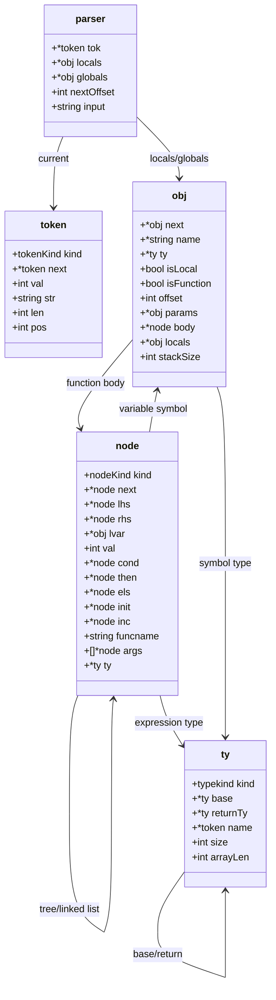
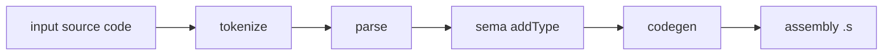

# g9cc Architecture Notes

このファイルは「今どのデータがどこで作られ、どこで使われるか」を追うためのメモです。

## 1. 構造図 (class diagram 風)

## 2. 処理フロー図

## 3. フィールド解説

### token

- `kind`
  - トークンの種類（数値、識別子、記号、予約語など）
- `next`
  - 次のトークンへのポインタ（連結リスト）
- `val`
  - 数値トークンの値（`kind == tkNum` のとき）
- `str`
  - トークン文字列そのもの
- `len`
  - トークン長（文字数）
- `pos`
  - 元入力文字列内の位置（エラー表示用）

### parser

- `tok`
  - 現在読んでいるトークン
- `locals`
  - 現在の関数スコープのローカル変数連結リスト
- `globals`
  - グローバル変数連結リスト
- `nextOffset`
  - 次に割り当てるローカル変数のスタックオフセット
- `input`
  - 元の入力文字列（エラーメッセージ生成に使う）

### node

- `kind`
  - ノード種別（加算、代入、if、return など）
- `next`
  - 文リスト（ブロック内）をつなぐ次ノード
- `lhs`, `rhs`
  - 二項演算や代入で使う左辺/右辺
- `lvar`
  - 変数ノードが参照するシンボル（`obj`）
- `val`
  - 数値リテラル値
- `cond`, `then`, `els`
  - `if`/`while`/`for` の条件・本体・else
- `init`, `inc`
  - `for` の初期化式・更新式
- `funcname`
  - 関数呼び出しの関数名
- `args`
  - 関数呼び出し引数の AST リスト
- `ty`
  - 型解析後に付く式の型

### obj

- `next`
  - 次のシンボル（連結リスト）
- `name`
  - 変数名/関数名
- `ty`
  - そのシンボルの型
- `isLocal`
  - ローカル変数かどうか
- `isFunction`
  - 関数シンボルかどうか
- `offset`
  - ローカル変数の `rbp` からのオフセット
- `params`
  - 関数パラメータの連結リスト
- `body`
  - 関数本体 AST
- `locals`
  - その関数が持つローカル変数リスト
- `stackSize`
  - 関数が使うスタック領域サイズ（将来拡張向け）

### ty

- `kind`
  - 型種別（`int`, `ptr`, `array`, `func`）
- `base`
  - ポインタ/配列の要素型
- `returnTy`
  - 関数型の返り値型
- `name`
  - 宣言子に対応する識別子トークン（補助情報）
- `size`
  - 型サイズ（byte）
- `arrayLen`
  - 配列要素数（配列型のとき）

## 4. 各段階で何を確定するか

- `tokenize`
  - 入力文字列を `token` 連結リストにする
- `parse`
  - AST (`node`) を作る
  - 宣言の型 (`obj.ty`) を確定する
  - 関数/グローバルを `obj` 連結リストで作る
- `sema(addType)`
  - 式ノード (`node`) に型 (`node.ty`) を付ける
- `codegen`
  - `obj` と `node` を使って `.data/.text` を出力する

## 5. まず追うと良い最短ルート

1. `int main(){ return 3; }`
2. `int main(){ int x; x=5; return x; }`
3. `int x; int main(){ x=5; return x; }`
4. `int main(){ int a[3]; a[1]=4; return a[1]; }`

各ケースで「parse後の `obj/node`」「sema後の `node.ty`」「codegen出力」の順に見れば、実装の理解がつながりやすいです。
